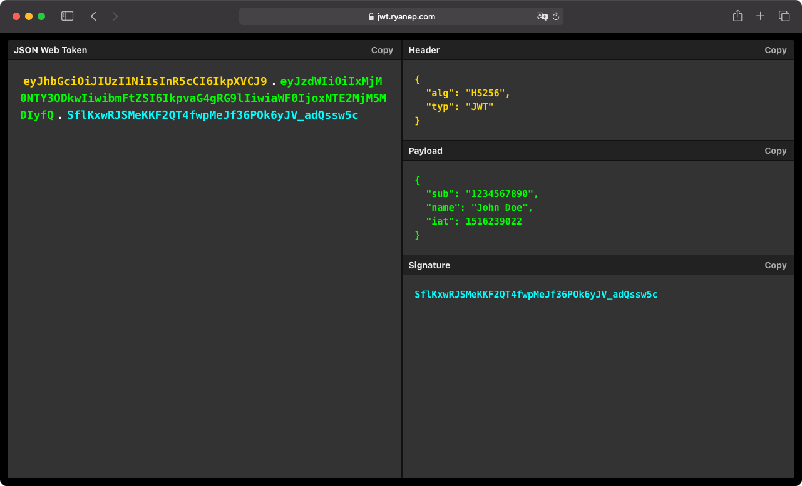

  

  <h1>JWT Decoder</h1>
  
A lightweight web application to decode JSON web tokens.

## Introduction

jwtdeco.de is a lightweight web application to decode JSON web tokens.

## Features

- Paste and view JSON web tokens.
- Copy full token or individual segments.
- Offline ready.

## Development

### Getting started

To get started with development, run the following commands:

- `yarn` - Install dependencies
- `yarn dev` - Watch for changes

### Linting

To lint the code, run `yarn lint`.

### Testing

To run the tests, run `yarn test`.

## Screenshot

## License

Licensed under the MIT license.
